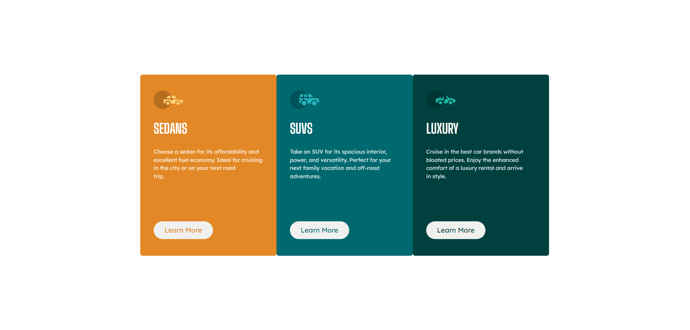
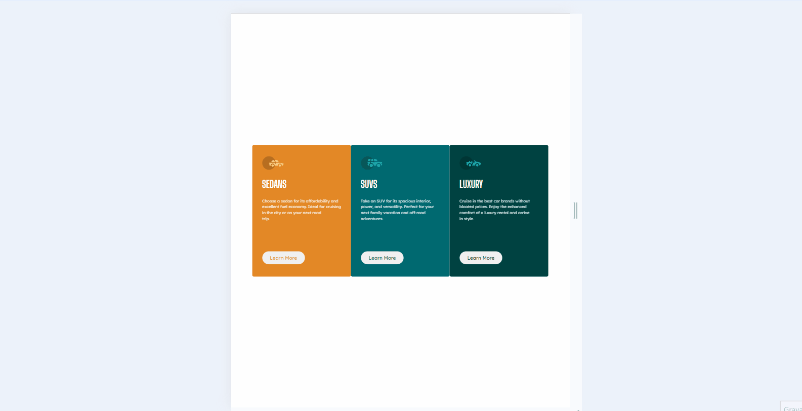

# 3 Column Preview Card Component Main

Aqui está mais um projeto que fiz utilizando HTML e CSS, esse é um projeto do Frontend Mentor ele conciste em um componente com três cartões que fala sobre três modelos de carros, aqui nesse projeto percebi uma melhora no meu código em relação aos ultimos projetos, logo estarei iniciando os meus estudos de JavaScript.

Gostaria muito do feedback de vocês 😁

Clicando nos gifs você será direcionado para o meu Linkdin

